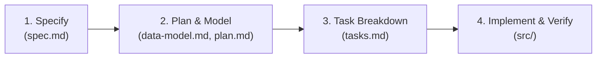

# Spec-Driven Development (SDD) • React To-Do Application

A complete guide and reference implementation of **Spec-Driven Development (SDD)** with `spec-kit` and React.

---

## 📖 Part 1: What is Spec-Driven Development (SDD)?

**Spec-Driven Development (SDD)** is an engineering methodology where structured, human-readable specifications act as the **single source of truth** throughout the entire software lifecycle. 

Instead of jumping straight into code or relying on ad-hoc prompts, SDD enforces a clear separation of concerns:



---

## 🛠️ Part 2: The 4 Steps of SDD

| Step | Command | Core Artifact | What Happens |
| :--- | :--- | :--- | :--- |
| **1. Specify** | `/speckit.specify <idea>` | [`specs/001-todo-app/spec.md`](./specs/001-todo-app/spec.md) | Captures **WHAT** and **WHY**: Prioritized user stories ($P1, P2, P3$), acceptance criteria (`Given/When/Then`), and edge cases. |
| **2. Plan & Model** | `/speckit.plan` | [`specs/001-todo-app/data-model.md`](./specs/001-todo-app/data-model.md)<br>[`specs/001-todo-app/plan.md`](./specs/001-todo-app/plan.md) | Captures **HOW**: Technical stack, entity interfaces, component trees, and CSS design system tokens. |
| **3. Tasks** | `/speckit.tasks` | [`specs/001-todo-app/tasks.md`](./specs/001-todo-app/tasks.md) | Deconstructs the plan into small, independently testable, ordered tasks. |
| **4. Implement** | `/speckit.implement` | `src/` | Builds each task sequentially, validating each user story against its acceptance criteria. |

---

## 📂 Part 3: Directory Architecture

Understanding the folder structure in a `spec-kit` project:

```text
todo-app/
├── .specify/                    # Tooling Engine & Templates (Internal)
│   ├── templates/               # spec-template.md, plan-template.md, tasks-template.md
│   ├── scripts/                 # Automation scripts (bash & python)
│   └── feature.json             # Active feature pointer
│
├── specs/                       # Living Feature Specifications (Source of Truth)
│   └── 001-todo-app/
│       ├── spec.md              # Requirements & User Stories
│       ├── data-model.md        # Entities, TypeScript interfaces & storage schema
│       ├── plan.md              # Technical architecture & CSS tokens
│       ├── tasks.md             # Granular task checklist (T001 - T021)
│       └── checklists/          # Quality validation checklists
│
└── src/                         # Source Code (Generated from specs)
    ├── components/              # UI components
    │   ├── Header.jsx           # App title & ThemeToggle
    │   ├── ThemeToggle.jsx      # Light / Dark / Auto mode switcher
    │   ├── StatsCard.jsx        # Completion progress meter & metrics
    │   ├── TodoInput.jsx        # Input bar with High/Med/Low priority selector
    │   ├── FilterBar.jsx        # Search, status tabs (All/Active/Done), and sort
    │   ├── TodoItem.jsx         # Inline editing, checkbox, badges, and delete
    │   └── TodoList.jsx         # Task container & empty state graphics
    ├── hooks/
    │   ├── useLocalStorage.js   # Safe localStorage persistence engine
    │   ├── useTheme.js          # Dark/Light theme with OS color scheme sync
    │   └── useTodos.js          # Todo CRUD, search, filter, and sorting
    └── styles/
        ├── variables.css        # CSS custom properties & theme tokens
        ├── main.css             # Base reset & layout structure
        └── components.css       # Micro-interactions, animations & responsive styles
```

---

## 🚀 Part 4: Running the Application

### 1. Install Dependencies
```bash
npm install
```

### 2. Start Development Server
```bash
npm run dev
```
Open **[http://localhost:3000/](http://localhost:3000/)** in your browser.

### 3. Build for Production
```bash
npm run build
```

---

## ✨ Features Implemented in the Todo App

* **🌗 Theme Engine**: Instant switching between Light, Dark, and Auto (OS `prefers-color-scheme`) modes with zero flash on reload.
* **💾 LocalStorage Sync**: Persistent task items and theme preferences across reloads and browser sessions.
* **⚡ Inline Editing**: Double-click any task title to edit inline (`Enter` to save, `Escape` to cancel).
* **🏷️ Priority Flags**: High, Medium, and Low priority tags with vibrant visual badges.
* **🔍 Search & Filter**: Real-time title search, status tabs (All / Active / Completed), and sorting (Newest, Priority, Title).
* **📊 Progress Meter**: Live progress bar with completion percentage and task counters.
